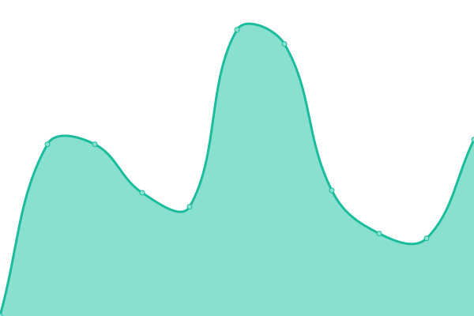

# [📈 Live Status](https://status.fan.my.id): <!--live status--> **🟩 All systems operational**

This repository contains the open-source uptime monitor and status page for [fanzyb](https://status.fan.my.id), powered by [Upptime](https://github.com/upptime/upptime).

With [Upptime](https://upptime.js.org), you can get your own unlimited and free uptime monitor and status page, powered entirely by a GitHub repository. We use [Issues](https://github.com/fanzyb/upptime/issues) as incident reports, [Actions](https://github.com/fanzyb/upptime/actions) as uptime monitors, and [Pages](https://status.fan.my.id) for the status page.

<!--start: status pages-->
<!-- This summary is generated by Upptime (https://github.com/upptime/upptime) -->
<!-- Do not edit this manually, your changes will be overwritten -->
<!-- prettier-ignore -->
| URL | Status | History | Response Time | Uptime |
| --- | ------ | ------- | ------------- | ------ |
|  [Personal Website](https://fan.my.id) | 🟩 Up | [personal-website.yml](https://github.com/fanzyb/upptime/commits/HEAD/history/personal-website.yml) | 

 579ms
     
 | 

<a href="https://status.fan.my.id/history/personal-website">99.76%</a>
    

|  [Link Website](https://link.fan.my.id) | 🟩 Up | [link-website.yml](https://github.com/fanzyb/upptime/commits/HEAD/history/link-website.yml) | 

 311ms
     
 | 

<a href="https://status.fan.my.id/history/link-website">100.00%</a>
    

|  [Drive](https://drive.manji.eu.org) | 🟩 Up | [drive.yml](https://github.com/fanzyb/upptime/commits/HEAD/history/drive.yml) | 

 416ms
     
 | 

<a href="https://status.fan.my.id/history/drive">100.00%</a>
    

|  [Drive 2](https://repo.kojedrive.workers.dev) | 🟩 Up | [drive-2.yml](https://github.com/fanzyb/upptime/commits/HEAD/history/drive-2.yml) | 

 95ms
     
 | 

<a href="https://status.fan.my.id/history/drive-2">100.00%</a>
    

<!--end: status pages-->

[**Visit our status website →**](https://status.fan.my.id)

## 📄 License

- Powered by: [Upptime](https://github.com/upptime/upptime)
- Code: [MIT](./LICENSE) © [Anand Chowdhary](https://anandchowdhary.com), supported by [Pabio](https://pabio.com)
- Data in the `./history` directory: [Open Database License](https://opendatacommons.org/licenses/odbl/1-0/)
